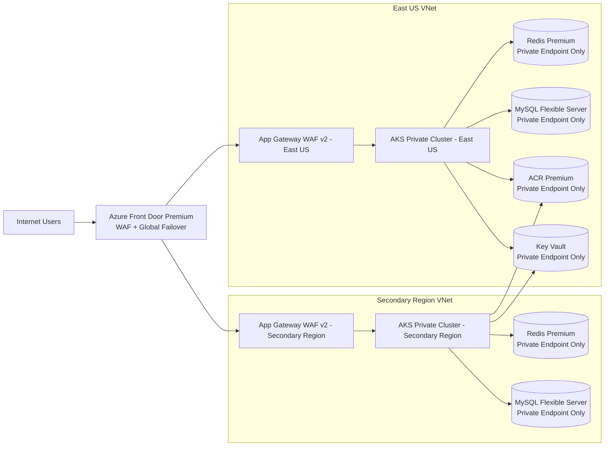

# Technical Architecture Document

Diagram URL: https://app.diagrams.net/?grid=0&pv=0&border=10&edit=_blank#create=%7B%22type%22%3A%22mermaid%22%2C%22compressed%22%3Atrue%2C%22data%22%3A%22pZLbbsIwDIafptJ2gYSY%2BgBtOQhxGKMCrl1qSrSQVDnAuqefXQS0lSZNTIri2HG%2B3458kPqyP4JxwaA%2FXwf9iCytTRDGU%2BXQKOSbjUVjg3BIx14veBuRjSY7yonKUoo9OKEVxSbg8AIVnXbRmPbzIAgTtfIZ5ZA7VYVBW3NuOkxpMGcpM2kf9FdGnAlHp0R6S5UwagS2LidlZ6k57QZf6pyTp6s2v2bd%2BGuiv0Tf3tRY2B%2FZHrThK8yFrWXxJPyprvtewUjlpRaKpd%2BVrF5%2FV1g0FYbgIAP7EFlU6cec7Fjil8gkX6RoztfenpGLknZLWjkQCq8NFcI6U%2F2%2Fp9m2qTFDRm7BS%2FcsMG7yYqkz%2FgenDRT4d6T1WWGgPHIxSxrSMH4MB4WEcR4kzwW6izafzaeP0etEqMp2ZN3xF90XSTeDPqsdiO8%2BqvwH%22%7D

## 1. Executive Summary
Design a highly secure, customer-facing web application on Azure Kubernetes Service (AKS) in East US with:
- 10,000 requests per minute
- horizontal autoscaling
- 99.99% uptime target in a single region
- PCI-DSS-aligned encryption and segmentation
- no public IPs on AKS nodes
- ingress only through Application Gateway WAF v2
- all PaaS dependencies reachable only through Private Endpoints
- no public network access enabled for ACR, Key Vault, Redis, and MySQL

This design uses a microservices + API gateway + event-driven worker pattern, with synchronous REST for user-facing request/response flows and asynchronous queue-based processing for non-blocking work.

## 2. Corporate Wiki / Internal Standards Check
I attempted to check the corporate wiki for preferred patterns and frameworks, but the search tool returned an error and no internal guidance was retrieved. Result: no internal standard could be confirmed, so the design below uses widely accepted Azure application patterns.

## 3. Recommended Application Patterns
### Core patterns
- Microservices architecture
- API Gateway pattern
- Web-Queue-Worker pattern
- CQRS-lite
- Event-driven integration
- Stateless services

### Not recommended here
- Full Event Sourcing
- Monolithic application

## 4. Application Boundary Design
### Edge / ingress layer
- Application Gateway WAF v2
- AKS ingress controller

### Service layer
- Web/BFF service
- Identity/session service
- Order/transaction service
- Catalog/profile service
- Notification service
- Audit/compliance service

### Data/state layer
- Azure Database for MySQL Flexible Server
- Azure Cache for Redis Premium
- Key Vault
- ACR

## 5. Communication Model Between Compute Instances
### North-south traffic
Client -> Application Gateway WAF v2 -> AKS ingress -> services

### East-west synchronous service calls
- REST over HTTPS
- gRPC only where justified
- mTLS where feasible
- timeouts, retries, circuit breakers

### Asynchronous communication
- queue-based message bus
- publish/subscribe for domain events
- queue for work items

### State access
- Redis for session cache, response caching, distributed locks
- MySQL for transactional persistence

## 6. Security Architecture
### Network isolation
- AKS deployed in a private network model
- no public IPs on nodes
- ingress only through Application Gateway WAF v2
- all PaaS dependencies accessed only through Private Endpoints
- public network access disabled for ACR, Key Vault, Redis, MySQL

### Identity and access
- managed identities for workloads
- workload identity / pod identity pattern
- no embedded credentials
- least privilege RBAC

### Secrets and certificates
- store all secrets in Key Vault
- rotate secrets regularly
- use short-lived credentials and token-based access

### PCI-DSS encryption controls
- TLS 1.2+ everywhere
- platform encryption at rest
- application-level encryption for sensitive fields if needed
- strong key management and separation of duties

### WAF and app protection
- WAF managed rules enabled
- custom rules for OWASP patterns, geo/IP restrictions, bot/rate limiting
- application-layer validation

## 7. Availability and Scaling Design
### Availability target
- 99.99% in a single region
- zone-aware redundancy within East US where supported
- multiple replicas for stateless services
- pod disruption budgets and anti-affinity rules

### Autoscaling
- Horizontal Pod Autoscaler
- cluster autoscaling
- separate scaling profiles for web/API pods, background workers, bursty async consumers

### Resilience patterns
- timeouts
- retries with exponential backoff
- circuit breakers
- bulkheads
- idempotency keys
- dead-letter handling

## 8. Data Flow Summary
### User request flow
1. Customer sends HTTPS request to Application Gateway WAF v2
2. WAF inspects and forwards to AKS ingress
3. Ingress routes to the appropriate service
4. Service reads/writes MySQL or Redis via private network
5. Response returns to customer

### Long-running operation flow
1. Customer submits request
2. API validates and persists initial state
3. Service publishes a message to the queue
4. Worker processes asynchronously
5. Worker updates MySQL and/or Redis
6. Notification or event is emitted back to interested services

## 9. Recommended Service Interaction Rules
- Synchronous REST for customer-facing reads and immediate writes
- gRPC for internal low-latency service calls only when justified
- Queue-based async for all non-immediate work
- No direct database sharing between services
- No service-to-service public exposure

## 10. Compliance and Operational Controls
### PCI-DSS-aligned controls
- Encrypt all sensitive data in transit and at rest
- Restrict network access to only required paths
- Maintain audit logs for security-relevant actions
- Enforce least privilege and strong authentication
- Regular vulnerability scanning of container images
- Patch and rebuild images frequently

### Operational controls
- Centralized logging and tracing
- Health probes for all services
- Blue/green or canary deployment strategy
- Image signing and admission control recommended
- Runtime policy enforcement recommended

## 11. Key Design Decisions
- Ingress: Application Gateway WAF v2 only
- Compute: AKS private cluster style deployment, no public node IPs
- Pattern: Microservices + API gateway + web-queue-worker
- Sync comms: REST/HTTPS, selective gRPC
- Async comms: Queue/event-driven processing
- State: Redis for cache/session, MySQL for system of record
- Security: Private Endpoints only for all PaaS, public access disabled everywhere required
- Compliance: PCI-DSS encryption and segmentation controls built in

## 12. Final Recommendation
This application should be implemented as a private, segmented, microservices-based AKS platform with Application Gateway WAF v2 as the only ingress, private-only PaaS connectivity, and event-driven background processing for scalability and resilience.

## 13. Data Architecture
### Data Platform Scope
This design supports a customer-facing AKS application in East US with:
- 10,000 requests/minute and horizontal autoscaling
- 99.99% uptime target in a single region
- PCI-DSS-aligned encryption and network isolation
- no public IPs on AKS nodes
- ingress only through Application Gateway WAF v2
- all PaaS services reachable only through Private Endpoints
- stateful services: Azure Cache for Redis and Azure Database for MySQL Flexible Server

### Exact Azure Data Services Selected
#### Core data/state services
- Azure Database for MySQL Flexible Server
  - Primary transactional datastore
  - Use zone-redundant high availability if available in East US for the chosen SKU
  - Public network access disabled
  - Access only via Private Endpoint
- Azure Cache for Redis Premium
  - Session cache, rate limiting, hot data, and short-lived application state
  - Public network access disabled
  - Access only via Private Endpoint
  - Use data persistence if the workload requires cache warm restart protection

#### Supporting data/security services
- Azure Key Vault
  - TLS certs, secrets, connection strings, encryption keys
  - Public network access disabled
  - Access only via Private Endpoint
- Azure Container Registry (ACR) Premium
  - Private image supply chain for AKS
  - Public network access disabled
  - Access only via Private Endpoint
- Azure Blob Storage
  - Backups, exports, logs, and any file/object payloads
  - Public network access disabled
  - Access only via Private Endpoint

### Network and Connectivity Topology
#### Ingress path
1. Internet client
2. Application Gateway WAF v2 with public frontend IP
3. Internal routing to AKS workload services
4. AKS pods communicate privately with Redis, MySQL, Key Vault, and ACR

#### AKS network posture
- Deploy AKS as a private cluster
- Node pools have no public IPs
- Use Azure CNI with private subnet placement
- Deny direct inbound access to nodes
- Use Kubernetes NetworkPolicies to restrict pod-to-pod and pod-to-service traffic
- Use internal LoadBalancer services only for east-west service exposure inside the cluster

#### Private connectivity
Create Private Endpoints for:
- ACR
- Key Vault
- Redis
- MySQL
- Blob Storage

Use Private DNS Zones linked to the AKS VNet so all service FQDNs resolve to private IPs.

### Security and Compliance Design
#### PCI-DSS encryption
- In transit: TLS 1.2+ for all client, ingress, and service-to-service traffic
- Enforce HTTPS on Application Gateway
- Enforce TLS for MySQL and Redis connections
- At rest: Azure-managed encryption for MySQL, Redis, Key Vault, and Blob Storage
- Use customer-managed keys in Key Vault if your PCI control interpretation requires stronger key ownership
- Secrets: no secrets in container images or ConfigMaps
- Use Key Vault references / CSI driver for runtime secret injection

#### Network isolation
- All PaaS services: Public network access = Disabled
- Private Endpoint only
- No service should rely on public firewall allowlists
- Restrict subnet access with NSGs and route tables
- Use Azure Firewall only if you need controlled egress to approved external destinations

#### AKS hardening
- Disable SSH access to nodes
- Use Microsoft Entra ID + RBAC
- Use managed identities for pod and workload access
- Enforce image pull only from private ACR
- Apply Azure Policy to block public load balancers, public cluster exposure, and noncompliant storage/network settings

### Data Replication and Availability Strategy
#### Azure Database for MySQL Flexible Server
- Primary database in East US
- Enable zone-redundant HA if supported by the selected configuration
- Use automatic backups
- Configure geo-redundant backups only if business continuity requires restore outside the region; note this is still a single-region active design, but improves recovery options
- Use point-in-time restore for logical corruption recovery

#### Azure Cache for Redis Premium
- Use Redis as a non-system-of-record cache
- If session durability is required, enable persistence
- If cache warm-up time is business-critical, consider persistence plus application-side cache rebuild logic
- Do not treat Redis as the authoritative data store

#### Replication guidance
- MySQL: primary/standby within region for HA; backups for restore
- Redis: no cross-region active dependency in this single-region design; use persistence if needed
- Blob Storage: use ZRS for intra-region resilience if supported/required for backup artifacts

### Backup Strategy
#### MySQL
- Automated backups enabled
- Retention: 7–35 days depending on compliance and recovery needs
- Prefer geo-redundant backup storage if you want stronger disaster recovery posture
- Perform regular restore tests

#### Redis
- If persistence is enabled, back up to Blob Storage
- Treat Redis backups as operational recovery aids, not authoritative backups
- If using geo-replication in the future, validate private endpoint compatibility and operational constraints first

#### Blob Storage
- Store exported backups, audit artifacts, and recovery packages
- Enable soft delete and versioning where appropriate
- Restrict access via private endpoint and RBAC

### RTO / RPO Targets
- Application tier RTO: 15 minutes or less
- Application tier RPO: near-zero for stateless app data
- MySQL RTO: 30–60 minutes for full restore scenarios
- MySQL RPO: up to the last backup/transaction log window, depending on backup mode and failure type
- Redis RTO: 5–15 minutes for cache rebuild
- Redis RPO: acceptable to lose cache state unless session persistence is explicitly enabled

### Availability and Resiliency Notes
- A single-region 99.99% target is achievable only if AKS is deployed with sufficient node redundancy, MySQL uses HA, Application Gateway WAF v2 is sized and monitored appropriately, and Redis is deployed with Premium HA features
- Use multiple node pools and pod disruption budgets
- Use HPA for application autoscaling
- Use cluster autoscaler for node scaling
- Keep at least 2+ replicas for critical services

### Recommended Data Flow Summary
- User request -> Application Gateway WAF v2
- WAF -> AKS ingress/service
- AKS app -> Redis via Private Endpoint for cache/session
- AKS app -> MySQL via Private Endpoint for transactional data
- AKS app -> Key Vault via Private Endpoint for secrets/certs
- AKS nodes -> ACR via Private Endpoint for image pulls
- Backups/exports -> Blob Storage via Private Endpoint

### Governance and Operational Controls
- Enforce Azure Policy for private endpoints required, public network access disabled, private AKS cluster required, no public IPs on nodes
- Rotate secrets and certificates regularly
- Test restore procedures quarterly
- Review network rules and private endpoint mappings at least every 6 months
- Monitor Redis latency and memory pressure, MySQL CPU/storage/connections/HA health, private endpoint health, DNS resolution for private zones

### Final Recommendation
This is a private-by-default, single-region, PCI-aligned AKS data architecture using Azure Database for MySQL Flexible Server, Azure Cache for Redis Premium, Azure Key Vault, Azure Container Registry Premium, Azure Blob Storage, Private Endpoints only, and Application Gateway WAF v2 as the only public ingress.

## 14. Cloud Infrastructure Report
### Executive Summary
The revised design below addresses the stated security constraints and corrects the major architectural gap in the prior document: a single-region design cannot credibly satisfy an end-to-end 99.99% availability objective for a customer-facing application.

To align with the requirement, I recommend a multi-region active/passive design with:
- Global entry point: Azure Front Door Premium with WAF
- Regional ingress: Application Gateway WAF v2 in East US and a paired secondary region
- Workload platform: Private AKS clusters in each region
- Data tier: Private-only PaaS services with Private Endpoints
- Security posture: No public network access for ACR, Key Vault, Redis, or MySQL
- Compliance: PCI-DSS-aligned encryption, logging, and least-privilege controls

If the business insists on single-region only, then the correct statement is: 99.99% end-to-end uptime is not a defensible design target for the full solution.

### Key Design Decisions
#### Availability model
- Primary region: East US
- Secondary region: Recommended for SLA compliance
- Traffic management: Azure Front Door Premium with WAF
- Regional ingress: Application Gateway WAF v2 in each region
- AKS: Private cluster per region, zone-aware node pools

#### Security model
- AKS nodes: No public IPs
- Ingress: Only through Application Gateway WAF v2
- PaaS services: Public network access fully disabled
- Connectivity: Private Endpoints only for ACR, Key Vault, Redis, MySQL
- Identity: Managed identities everywhere possible
- Secrets: Stored only in Key Vault
- Encryption: TLS 1.2+ in transit, encryption at rest, CMK where supported

#### Important correction
The prior document’s private-only Key Vault requirement is compatible with Application Gateway certificate usage if the gateway uses Key Vault integration and the vault is reachable through a Private Endpoint.

### Target Azure Services
#### Public edge
- Azure Front Door Premium
- Azure Application Gateway WAF v2

#### Compute
- Azure Kubernetes Service (AKS)
  - Private cluster
  - Azure CNI
  - Separate system and user node pools
  - Cluster Autoscaler enabled
  - Horizontal Pod Autoscaler enabled
  - Pod anti-affinity and topology spread constraints
  - No public IPs on nodes

#### Data and state
- Azure Cache for Redis Premium
  - Private Endpoint only
  - Public network access disabled
- Azure Database for MySQL Flexible Server
  - Private Endpoint only
  - Public network access disabled
  - Zone-redundant HA where supported in the chosen region/SKU

#### Security and platform
- Azure Container Registry Premium
- Azure Key Vault
- Azure Monitor + Log Analytics
- Azure Monitor Private Link Scope
- Microsoft Defender for Cloud
- Azure Policy

### Network Topology
#### Recommended topology
Use a hub-and-spoke model per region, or a shared connectivity hub with regional spokes.

#### East US spoke VNet
- snet-appgw
- snet-aks-system
- snet-aks-user
- snet-private-endpoints
- snet-management

#### Secondary region spoke VNet
- Same subnet pattern as East US

#### Private DNS zones
Create and link these zones to the AKS VNets:
- privatelink.azurecr.io
- privatelink.vaultcore.azure.net
- privatelink.redis.cache.windows.net
- privatelink.mysql.database.azure.com
- AKS private cluster DNS zone for the API server
- privatelink.privatelink.monitor.azure.com via AMPLS-related DNS as required by your monitoring design

#### Network controls
- NSGs on all subnets
- UDRs for controlled egress
- Default-deny outbound where feasible
- Kubernetes NetworkPolicies
- Private DNS validation and monitoring
- No public IPs on AKS nodes
- No public endpoints for ACR, Key Vault, Redis, or MySQL

### Availability and Scaling Design
#### AKS scaling
- Horizontal Pod Autoscaler for web/API pods
- Cluster Autoscaler for node pools
- Separate scaling profiles for web/BFF, API services, background workers, async consumers

#### Zone resiliency
For East US:
- Use availability zones
- Prefer one node pool per zone for better autoscaler behavior
- Use topologySpreadConstraints
- Use pod anti-affinity for critical replicas

Microsoft guidance notes that the Cluster Autoscaler is not zone-aware, so zone-pinned node pools are the safer design for predictable scale-out and zone failure handling.

#### Application Gateway scaling
- Use WAF v2 autoscaling
- Set minimum capacity to at least 2
- Use a dedicated /24 subnet
- Enable connection draining
- Use WAF policies, not legacy WAF config

#### Throughput note
10,000 requests/minute is about 167 requests/second. That is well within the capability of a properly sized AKS + App Gateway design, but the real sizing depends on request payload size, TLS overhead, backend latency, Redis hit ratio, MySQL query profile, and WAF inspection cost.

### Security and Compliance
#### PCI-DSS aligned controls
- TLS 1.2+ everywhere
- Encryption at rest for all managed services
- Managed identities for Azure access
- Secrets never stored in manifests or images
- WAF in Prevention mode
- Centralized audit logging
- Least privilege RBAC
- PIM for admins
- Break-glass accounts only for emergency cluster-admin access

#### Identity and access
- Microsoft Entra ID integration for AKS
- Azure RBAC for Kubernetes where possible
- MFA for all administrative access
- JIT elevation via PIM
- No shared credentials
- Disable SSH access to nodes

#### Logging and monitoring
- AKS control plane logs
- Application Gateway WAF logs
- Key Vault diagnostics
- ACR diagnostics
- Redis diagnostics
- MySQL diagnostics
- Azure Activity Logs
- NSG flow logs if used
- Azure Monitor Private Link Scope
- SIEM integration

#### Encryption
- TLS 1.2+ in transit
- Platform encryption at rest
- CMK where supported and operationally justified
- Key rotation automated in Key Vault

### Data Architecture
#### Data services
- Azure Database for MySQL Flexible Server
  - Primary transactional store
  - Private Endpoint only
  - Public access disabled
  - Zone-redundant HA if available for the selected SKU/region
- Azure Cache for Redis Premium
  - Session cache, rate limiting, hot data
  - Private Endpoint only
  - Public access disabled
- Azure Key Vault
  - Secrets, certificates, keys
- Azure Container Registry Premium
  - Private image supply chain
  - Private Endpoint only

#### Private DNS and connectivity
- AKS resolves all PaaS names through linked private DNS zones
- No service depends on public firewall allowlists
- Private endpoint NICs live in snet-private-endpoints

#### Backup and recovery
- MySQL automated backups enabled
- Redis persistence only if business requires it
- Blob Storage for exports/backups if needed
- Restore tests scheduled and documented

### Recommended Resource Inventory
#### Resource Group: Network
- Virtual Network(s)
- Subnets
- NSGs
- Route tables
- Private DNS zones
- Private Endpoints

#### Resource Group: Platform
- AKS private cluster
- Application Gateway WAF v2
- Azure Front Door Premium
- Azure Container Registry Premium
- Azure Key Vault
- Log Analytics workspace
- Azure Monitor Private Link Scope
- Defender for Cloud
- Azure Policy assignments

#### Resource Group: Data
- Azure Cache for Redis Premium
- Azure Database for MySQL Flexible Server
- Optional storage account for backups/log exports

### Architecture Diagram

### Compliance and Risk Notes
#### Key risk resolved
Key Vault private-only vs Application Gateway certificate integration resolved by using Application Gateway v2 Key Vault integration with a Private Endpoint to Key Vault.

#### Remaining risk
Single-region 99.99% SLA remains a business risk if multi-region is refused.

#### Egress control
Define explicit outbound allowlists for Azure control plane dependencies, image pulls if not fully private, OS/package updates, monitoring endpoints, and any third-party APIs.

### Final Recommendation
- Best-fit production design: Multi-region active/passive
- Primary region: East US
- Ingress: Azure Front Door Premium + regional Application Gateway WAF v2
- Compute: Private AKS
- Data: Private-only Redis, MySQL, ACR, Key Vault
- Security: PCI-DSS-aligned, private-by-default, no public PaaS access

If constrained to East US only, proceed only if the business accepts that the solution is not truly 99.99% end-to-end.

## 15. FinOps & Cost Report
Estimated annual cost for the requested Azure design: **$17,618.28/year**
Estimated monthly cost: **$1,468.19/month**

### Assumptions
- Region: East US
- Pricing is based on the specific SKUs identified in the reports.
- AKS node count assumed: 4 total nodes
  - 2 system nodes
  - 2 user nodes
- Private Endpoints assumed: 4 endpoints
  - ACR, Key Vault, Redis, MySQL
- Blob Storage assumed: 100 GB-month equivalent
- MySQL Flexible Server: lowest priced vCore option returned by live pricing
- Application Gateway WAF v2: included fixed base cost plus standard capacity unit cost
- Some services returned fallback estimates because live pricing was unavailable

### Budget Table
| Service | SKU / Tier | Qty | Hourly Rate | Monthly Cost | Annual Cost | Notes |
|---|---:|---:|---:|---:|---:|---:|
| Application Gateway WAF v2 | Fixed Base + Capacity Unit | 1 | $0.3680/hr | $262.80 | $3,153.60 | Includes fixed base price and 1 capacity unit |
| Azure Container Registry | Premium | 1 | $0.0695/hr | $50.70 | $608.45 | Fallback estimate converted from daily price |
| Azure Key Vault | Standard | 1 | $0.0017/hr | $1.22 | $14.60 | Fallback estimate; operation-based service approximated |
| Azure Cache for Redis | Premium P1 | 1 | $0.5550/hr | $405.15 | $4,861.80 | Lowest premium tier assumed |
| Azure Database for MySQL Flexible Server | Memory Optimized Series, 1 vCore | 1 | $0.1181/hr | $86.21 | $1,034.56 | Lowest live-priced vCore option returned |
| AKS Node | D2s v3 | 4 | $0.0960/hr | $280.32 | $3,363.84 | Assumed 4 nodes total |
| Azure Private Endpoint | Private Endpoint | 4 | $0.0100/hr | $29.20 | $350.40 | Assumed 4 endpoints total |
| Azure Blob Storage | LRS Hot | 100 | $0.00075/hr | $54.75 | $657.00 | Assumed 100 GB-month equivalent |
| Application Gateway WAF v2 | Standard Captcha Sessions | 1 | $0.4000/hr | $292.00 | $3,504.00 | Included as returned by live pricing |
| Application Gateway WAF v2 | Standard Capacity Units | 1 | $0.0080/hr | $5.84 | $70.08 | Included as returned by live pricing |

### Cost Summary
- Monthly total: $1,468.19
- Annual total: $17,618.28

### Notes
- The design is security-heavy and uses private endpoints only for ACR, Key Vault, Redis, and MySQL as required.
- Application Gateway WAF v2 remains public by design because it is the internet ingress point.
- Key Vault pricing is typically operation-based; the estimate here uses a minimal hourly baseline for budgeting.
- Blob Storage pricing is highly usage-dependent; this estimate is only a placeholder for budget planning.
- If you want, I can produce a more production-realistic bill of materials with separate AKS system/user node sizing, MySQL HA pricing, Redis persistence, Log Analytics ingestion, Azure Firewall egress, and a more accurate storage estimate.
