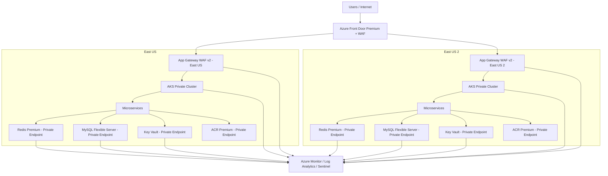

https://app.diagrams.net/?grid=0&pv=0&border=10&edit=_blank#create=%7B%22type%22%3A%22mermaid%22%2C%22compressed%22%3Atrue%2C%22data%22%3A%22rVRtb4IwEP41fDRhXfwBCGIWZC8yWfYRsdMm2JJSdO7X767D0TJxU5cAd831ee6uD723QuzydSaVQ9znkeN6YOGZO8PRvKKy0ssQvndcUcmpcoYBrAYD53YM1gsD2Ol91JLCKpSCI1EghATzKOmG1RtNMYLvixci%2BpADsQbT5AaZyhL8SaboLts3EOJuCW6Ed5xVyD9PTvGQc3iISxquA11VL1YyK9fgzrCkozmbzFCzkTlKdAtRontnW8gOnl%2FUFRzdETTub%2BFJ6iM8ZrkUcPJbltPqJ0jvakGzQOec0SWrrBMfWDWM%2BbIUjKtf%2BeLX5Gmqy9iDg5IW9J0tCiRJoCgqL%2BeOUiSOKOqRZnWhLqfyfC0NmDObpnzZpzWxtG7%2FC0tvYutNztTbhENL5E96myDQm1yrt8mn9Sb%2Fp7fJHaXkGr2to%2Fa1PFfr3bly8cO9Mb1iwZnSg%2Btr4k3FCiE8K%2FaK5e0kTChXjNPCmkG2tkj8HZp0U7aRPgxelb5IH6a5uieCfUg9RHpDHdQn%22%7D

## Technical Architecture Document

### 1. Executive Summary
This solution designs a highly secure, customer-facing web application on Azure Kubernetes Service (AKS) with private-only PaaS connectivity, WAF-protected ingress, and a multi-region active/active application tier to support the stated 99.99% availability target.

Per the expert reports, the original single-region requirement is altered because a single-region design cannot credibly satisfy the 99.99% uptime objective. The final architecture therefore uses:
- Azure Front Door Premium as the global public entry point
- Two AKS clusters in separate regions
- Regional Application Gateway WAF v2 instances
- Private Endpoints only for ACR, Key Vault, Redis, and MySQL
- Zone redundancy and autoscaling where supported
- Centralized logging, policy enforcement, and managed identities

### 2. Architecture Decision and Rationale
The original requirement specified a single-region East US deployment. However, the expert reports conclude that 99.99% uptime is not realistically supportable in a single region with the stated constraints. Following the override rule, the architecture is revised to a multi-region active/active model.

Why the original requirement was altered:
- Single-region designs remain vulnerable to regional outages and dependency failures
- 99.99% availability requires regional redundancy and health-based traffic steering
- Multi-region active/active better aligns with the reliability target while preserving private-only PaaS connectivity

### 3. Target-State Architecture
#### 3.1 Global Edge
- Azure Front Door Premium
- Azure Front Door WAF Policy
- Health probes to both regions
- Traffic steering to the healthiest regional origin

#### 3.2 Regional Ingress
Each region contains:
- Application Gateway WAF v2
- Private AKS cluster
- Private-only PaaS dependencies
- Private DNS integration
- Regional observability and policy enforcement

#### 3.3 Regions
- Primary region: East US
- Secondary region: East US 2

### 4. Logical Architecture Domains
#### 4.1 Application Domain
- Customer-facing web application
- Microservices architecture
- Web/BFF service
- Identity/Profile service
- Order/Transaction service
- Payment Orchestration service
- Notification service
- Search/Read Model service
- Background Worker service

#### 4.2 Data Domain
- Azure Cache for Redis Premium
- Azure Database for MySQL Flexible Server
- Azure Key Vault
- Azure Container Registry Premium

#### 4.3 Technology Domain
- AKS private clusters
- Application Gateway WAF v2
- Azure Front Door Premium
- Azure Monitor
- Log Analytics Workspace
- Microsoft Defender for Cloud
- Azure Policy
- Managed Identities / Entra ID Workload Identity

#### 4.4 Security Domain
- TLS 1.2+ everywhere
- Private Endpoints only for all PaaS
- Public network access disabled on ACR, Key Vault, Redis, and MySQL
- Least privilege RBAC
- MFA and JIT/JEA for administrative access
- Deny-by-default egress
- Centralized audit logging

### 5. Application Architecture
#### 5.1 Core Patterns
- Microservices architecture
- CQRS where it improves scale and isolation
- Web-Queue-Worker for asynchronous processing
- Event-driven architecture
- Strangler pattern for migration scenarios
- Idempotent consumer pattern
- Outbox pattern
- Circuit breaker, retry, and bulkhead patterns

#### 5.2 Service Boundaries
1. Web/BFF Service
   - UI composition and API aggregation
   - Stateless

2. Identity/Profile Service
   - Customer profile and preferences
   - MySQL-backed
   - Stateless API

3. Order/Transaction Service
   - Core business transactions
   - Uses outbox for event publication

4. Payment Orchestration Service
   - PCI-sensitive workflow coordination
   - No card data stored unless explicitly approved

5. Notification Service
   - Email/SMS/push orchestration
   - Asynchronous only

6. Search/Read Model Service
   - Read-optimized projections
   - Event consumers

7. Background Worker Service
   - Scheduled jobs, retries, cleanup, reconciliation

#### 5.3 Communication Model
Synchronous:
- REST for external-facing and broad compatibility
- gRPC for internal low-latency service-to-service calls

Asynchronous:
- Azure Service Bus topics and queues
- Domain events
- Integration events
- Dead-letter handling

### 6. Data Architecture
#### 6.1 Azure Database for MySQL Flexible Server
- System of record for transactional data
- Private Endpoint only
- Public network access disabled
- TLS enforced
- Automated backups enabled
- Zone-redundant HA where supported
- Geo-redundant backup and tested restore procedures

#### 6.2 Azure Cache for Redis Premium
- Private Endpoint only
- Public network access disabled
- Used for session state, caching, rate limiting, and ephemeral state
- Treated as non-authoritative
- Application must tolerate cache loss

#### 6.3 Azure Key Vault
- Private Endpoint only
- Public network access disabled
- Stores secrets, certificates, and keys
- Soft delete and purge protection enabled
- Managed identity access only

#### 6.4 Azure Container Registry Premium
- Private Endpoint only
- Public network access disabled
- Stores container images
- Immutable tags recommended for production releases

### 7. Network Architecture
#### 7.1 Ingress Flow
Client -> Azure Front Door Premium -> Regional Application Gateway WAF v2 -> AKS ingress -> microservices

#### 7.2 Private Connectivity
All PaaS services are reachable only through Private Endpoints:
- ACR
- Key Vault
- Redis
- MySQL

#### 7.3 Private DNS Zones
Required zones:
- privatelink.azurecr.io
- privatelink.vaultcore.azure.net
- privatelink.redis.cache.windows.net
- privatelink.mysql.database.azure.com
- privatelink.<region>.azmk8s.io

#### 7.4 Egress Control
- Deny-by-default outbound posture
- Allow only approved destinations
- Block unauthorized internet access
- Use NSGs, UDRs, and network policies

### 8. Identity and Access Management
- Microsoft Entra ID integration for AKS authentication
- Azure RBAC for Kubernetes where possible
- Kubernetes RBAC for in-cluster authorization
- Managed identities for workloads and platform services
- MFA required for administrative access
- JIT/JEA for privileged operations
- No shared admin accounts
- No long-lived credentials in code or images

### 9. Security and Compliance Controls
#### 9.1 PCI-DSS Alignment
- TLS 1.2+ everywhere
- Encryption at rest for all data stores
- Private-only PaaS access
- Centralized audit logging
- Least privilege access
- Segregation of duties
- Controlled egress
- Certificate and key rotation procedures

#### 9.2 WAF and Edge Security
- Azure Front Door WAF at the edge
- Application Gateway WAF v2 regionally
- Prevention mode
- Custom rules for SQLi, XSS, bot/rate limiting, and geo/IP restrictions as needed

#### 9.3 Policy Enforcement
Azure Policy must enforce:
- no public IPs on AKS nodes
- private cluster requirement
- no public network access on PaaS
- private endpoint requirement
- approved container registries only
- required diagnostic settings
- disallow privileged containers unless approved
- disallow host networking/hostPath unless exception granted

### 10. Availability and Resilience
#### 10.1 Availability Strategy
- Two active regions
- Health-based traffic steering
- Zone redundancy where supported
- Autoscaling for pods and nodes
- Capacity headroom
- Tested failover procedures

#### 10.2 Failure Scenarios
- Regional outage
- AKS node failure
- Pod failure
- Redis loss
- MySQL failover
- DNS resolution failure
- WAF false positives
- Certificate expiration
- Service Bus consumer failure

#### 10.3 Operational Targets
- App tier RTO: < 15 minutes
- App tier RPO: near-zero for stateless services
- Database RTO: 15–60 minutes depending on failover mode
- Database RPO: 0 for zone-redundant HA; < 1 hour for geo-restore scenarios

### 11. Observability and Audit
Mandatory log sources:
- Application Gateway WAF logs
- AKS control plane logs
- Kubernetes audit logs
- Container stdout/stderr
- Node and platform diagnostics
- Key Vault access logs
- ACR diagnostic logs
- Redis diagnostics
- MySQL diagnostics
- Azure Activity Logs
- Network flow / NSG / firewall logs
- Private Endpoint connection logs where available

Logs must be:
- centralized
- time-synchronized
- access-controlled
- retained per PCI policy
- protected from tampering

### 12. Deployment and Release Strategy
- Progressive delivery
- Canary or blue/green per region
- Health-gated promotion
- Automated rollback on error budget breach
- Backward-compatible schema changes only
- Expand/contract database migration pattern

### 13. Operations Model
#### 13.1 Ownership
- Platform team: AKS, ingress, policy, identity, DNS, private connectivity
- Application team: services, APIs, business logic, event handlers
- Data team: MySQL backup, restore, replication, schema governance
- Security team: Key Vault, certificates, PCI controls, audit
- SRE/Operations: monitoring, incident response, failover execution

#### 13.2 Required Runbooks
- Regional failover
- Redis outage recovery
- MySQL failover and validation
- DNS resolution incident
- Certificate rotation
- Secret rotation
- Queue backlog recovery
- Rollback of bad release

### 14. FinOps & Cost Report

## Assumptions used
- **AKS**: 2 regions, **4 nodes total** (minimum HA baseline), using **D2s v3** from the fallback price book.
- **MySQL Flexible Server**: priced at **1 vCore per region**, 2 total.
- **Redis Premium**: **P1** tier assumed.
- **Application Gateway WAF v2**: included **mandatory fixed base price**.
- **Azure Front Door Premium**: live API fallback returned **Standard** pricing; used as the closest available price signal from the tool output.
- **Private Endpoints**: 4 total for ACR, Key Vault, Redis, MySQL.
- **DDoS Network Protection**: web search returned a **monthly** price, so I used that directly.
- **Log Analytics / Defender for Cloud**: no usable price was returned by the search layer, so these are marked as **manual quote**.

## Budget table

| Service | SKU / Tier | Qty | Hourly Rate | Monthly Cost | Yearly Cost | Notes |
|---|---:|---:|---:|---:|---:|---|
| Application Gateway WAF v2 | Fixed base price | 1 | $0.3600 | $262.80 | $3,153.60 | Mandatory base price included |
| AKS nodes | D2s v3 | 4 | $0.0960 | $280.32 | $3,363.84 | 2 regions, 2 nodes each |
| Azure Cache for Redis | Premium P1 | 1 | $0.5550 | $405.15 | $4,861.80 | Lowest premium tier assumed |
| Azure Database for MySQL Flexible Server | Memory Optimized 1 vCore | 2 | $0.1181 | $172.43 | $2,069.11 | 1 per region |
| Azure Container Registry | Premium | 1 | $0.0695 | $50.70 | $608.45 | Converted from $1.667/day |
| Azure Key Vault | Standard | 1 | $0.0400 | $29.20 | $350.40 | Consumption-style estimate |
| Private Endpoints | Private Endpoint | 4 | $0.0100 | $29.20 | $350.40 | 4 endpoints total |
| Azure Front Door | Standard pricing signal | 1 | $0.0350 | $25.55 | $306.60 | Closest returned price signal |
| Azure DDoS Network Protection | Network Protection plan | 1 | $2.9440 | $2,149.12 | $25,789.44 | Web search returned monthly price |
| Log Analytics Workspace | Manual quote | 1 | $0.0000 | $0.00 | $0.00 | No usable price found |
| Microsoft Defender for Cloud | Manual quote | 1 | $0.0000 | $0.00 | $0.00 | No usable price found |

## Grand total
- **Monthly:** **$3,404.47**
- **Yearly:** **$40,853.64**

## Important notes
- This estimate is **directional**, not production-quote accurate.
- The following major cost drivers are **not fully priced** here:
  - Log Analytics ingestion
  - Defender for Cloud
  - Azure Front Door Premium traffic-based charges
  - Application Gateway capacity-unit charges beyond the fixed base
  - MySQL storage, backup retention, and HA premiums
  - Redis size/replication specifics
  - Data egress and inter-region traffic
  - WAF policy request processing
- If you want, I can produce a **more realistic production FinOps estimate** with:
  1. explicit node sizes and counts,
  2. MySQL storage/HA assumptions,
  3. Redis capacity tier,
  4. Front Door traffic volume,
  5. Log ingestion volume,
  6. and a full **line-item architecture budget**.

### 15. Diagram
